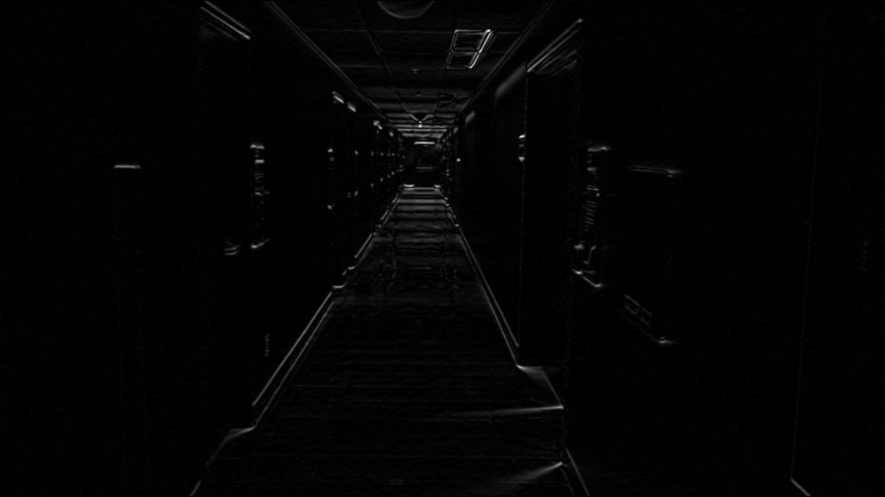
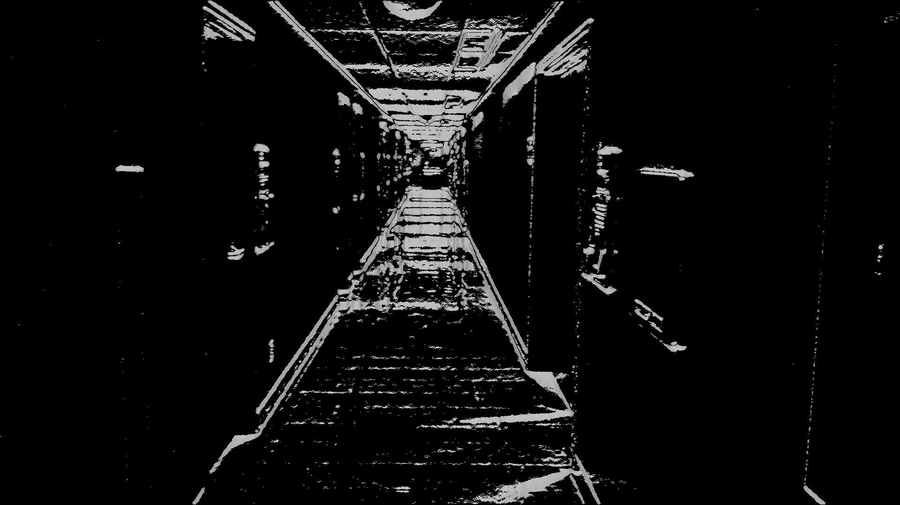
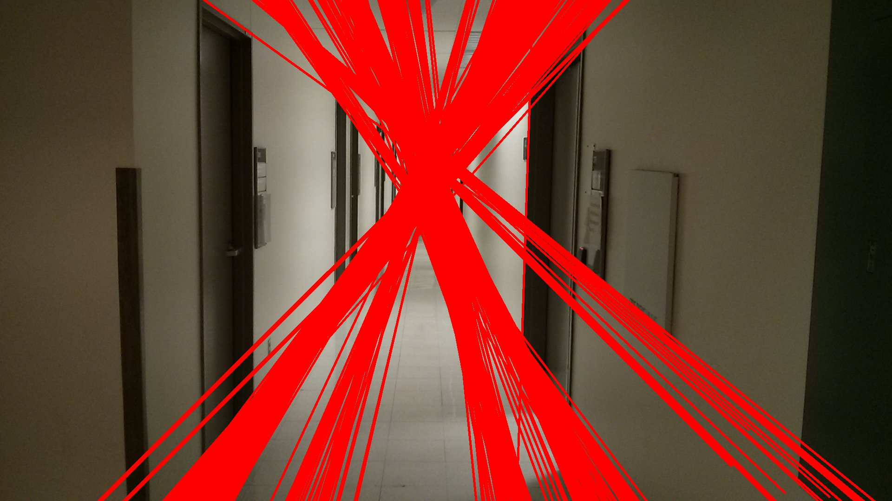

# Vanishing_point
Detects vanishing points in an image

Parallel lines, not perpendicular to the plane of the camera, intersect at a point as a consequnce of perspective projection. 
The intersection point may not always be in the image plane. This module attempts to detect such an intersection point (vanishing point) 
in an indoor setting (corridor).

  

  

  

  

  

